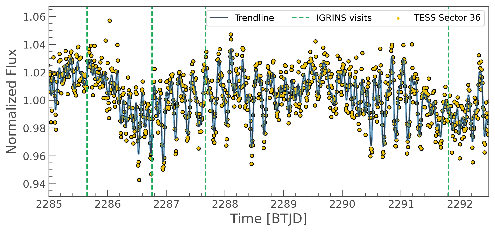

# varsity

Multi-epoch time series monitoring of Luhman 16 A and B with contemporaneous IGRINS and TESS, exploring spectral decomposition of clouds.

This Gemini South DDT observations occurred between March 8-18, 2021.

*Watch our [2021 TESS Sci Con YouTube talk](https://www.youtube.com/watch?v=0yLgE_8YsIM&t=144s)*

We acquired 4 IGRINS visits, orienting the slit perpendicular to the PA, and placing the A and B components separately on the slit for easier spectral isolation and extraction.  This brief [observation planning slideshow](https://docs.google.com/presentation/d/1KIv9qooJAdg6cPklO8GSU09w8XbwuukSumUqnNEWejM/edit?usp=sharing) summarizes these and other observational considerations.

### Authors:
- Michael Gully-Santiago (UT Austin)
- Caroline Morley (UT Austin)
- Yifan Zhou (UT Austin)
- Will Best (UT Austin)
- Brendan Bowler (UT Austin)

Copyright @gully 2021, All Rights Reserved
